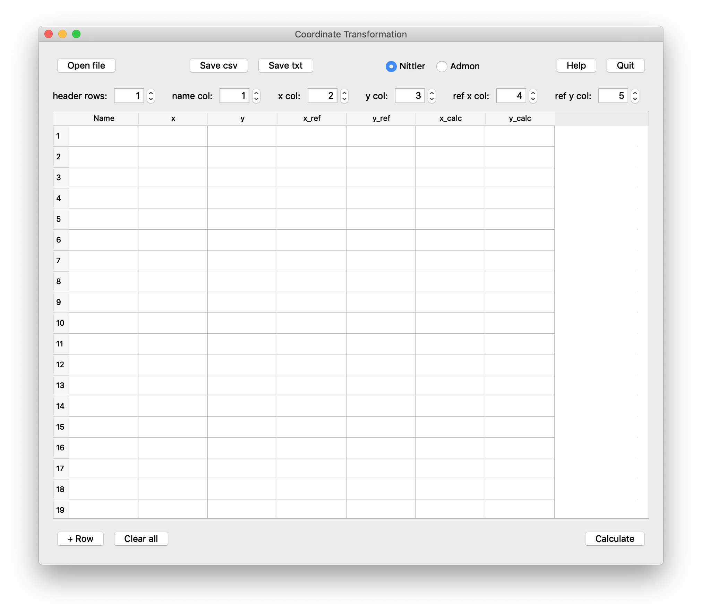
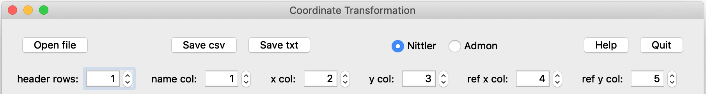

# CoordinateTransformation

This software package facilitates the relocation of samples in various instruments. If you have coordinates recorded in one instrument, relocating two or more of your samples in the new coordinate system will be enough to successfully transform all coordinates.

## Methods

Two methods are currently implemented and can be selected on the top of the menu bar by selecting the according radio button. It is important that you understand the difference between the methods and the limitations of each.

### Admon

[Admon et al. (2005)](https://doi.org/10.1017/S1431927605050312) published the mathematical transformation in order to relocate samples in different coordinate systems by choosing three fiducials. Exactly three fiducials are required for the transformation. These three fiducials define one transformation matrix, from which all subsequent coordinates are calculated.

The method by Admon et al. (2005) works great when two different coordinate systems that are not based on the same units are used. This method, in comparison to the Nittler method (see below), does consider stretching the coordinate system. However, the method by Admon et al. (2005) does not account for mechanical slack.

The Admon method should be used when transforming between coordinate systems with different units, e.g., between pixels and millimeters.

### Nittler

The method called *Nittler* is described in Larry Nittler's PhD thesis, [Appendix F](https://nittler.dtm.carnegiescience.edu/publications/phd-thesis). It is based on determining the offset and rotation of two coordinate systems with respect to each other. At least two fiducials are required. If further fiducials are entered a linear fit to the over determined system is calculated, i.e., the calculation method automatically averages and determines the best fit to the given fiducials. The sum of all the differences between the calculated (x, y) coordinates and the fiducial coordinates is summed up and displayed at the bottom. This number is fairly arbitrary but gives an idea on how good the fit is, it should ideally be as small as possible.

While the Nittler method does not account for stretched coordinate systems, it should be used when transforming coordinates within identical coordinate systems. Over determining the system by adding more and more fiducials leads to a better and better fit since mechanical slack and user errors are statistically eliminated.

## Software usage

Below image shows an overview of the full program. 

The main program can be broken up into three distinct parts:

 * Top row: Includes file manipulations and options
 * Table: Coordinates in old, reference, and new coordinate system
 * Bottom: Table manipulation and calculation button / display

**Note:** The program has tooltips implemented. If you need to know what a given button / option does, hover over it with your mouse and help will appear.

### Top row

The following image shows a screenshot of the top of the program. 

#### File manipulation

The `Open file` can be used to read in a file. Supported formats are comma separated `.csv` files, tab separated `.txt` files, and Excel files (`.xls` and `.xlsx`). 

The results can be saved in two different formats, as comma separated `.csv` files and as tab separated `.txt` files. Comma separated files can generally be directly opened by your table calculation program. 

#### Methods

The radio buttons on the right side of the top row are used to chose the calculation method. Please see the section above on the difference between Admon and Nittler.

#### Help and Quit

The help button displays some simple help and displays the references to the literature. The quit button exits the program. Note: You will not be asked if you want to save any changes.

#### Options

The options line (second row) is used to specify your input file. Here you can specify your input:

 * header rows: Specify how many rows of header before the data stars. 
 * name col: Specify in which column the feature name is stored. 0 for no name.
 * x col: Column number where to find the x value in the old coordinate system
 * y col: Column number where to find the y value in the old coordinate system
 * x ref: Column number where to find the x reference value: new coordinate system
 * y ref: Column number where to find the y reference value: new coordinate system

The reference column are your fiducial marks that you know in the new coordinate system. Based on these fiducials, the coordinate transformation will be calculated.

### Table

The table portion functions similar to any table calculation program. New rows can be added by pressing the `+ Row` button at the bottom of the screen. 

If you read in a file, data will be auto populated. You can also copy and paste information into this table. Please use the standard keyboard shortcuts. On OSX: `Cmd+C` for copy or `Cmd+V` for paste, on Windows, Linux systems `Ctrl+C` for copy or `Ctrl+V` for paste. You can also delete the entries in selected cells by hitting `delete`. 

If you prefer the mouse: select cells and then hit the right mouse button to bring up the context menu. Here you can also copy, paste, or delete.

### Bottom

The bottom row implements a few more buttons. Hit `+ Row` to add an empty row in the table. Note: If you paste information in, the necessary numbers of rows will automatically be appended. 

The `Clear all` button will do exactly what it says: it will clear the whole table. 

On the right you will find the `Calculate` button. Once you have your old coordinates and references loaded / entered, click calculate to transform the coordinates using your method of choice. 

## Development

Please read here if you want to contribute to this project or compile the software from source.

### Compiling instructions

The Coordinate Transformation software is written in Python and requires python 3.6 and the [fman build system (fbs)](https://build-system.fman.io/) for compilation. Assuming you have python installed, please follow the following steps:

#### Create a virtual environment

Here it is assumed that you installed python via conda and that you use conda to manage your environment. If not please follow the first few steps of the [fbs tutorial](https://github.com/mherrmann/fbs-tutorial) to create a virtual environment from your python3.6 interpreter and activate the environment. 

Alternatively if you use conda create a new virtual environment named `coord` by typing:

	conda create -n coord python=3.6

This will create a virtual environment with python3.6 as the base interpreter, no matter what your default base interpreter is. Activate the environment by typing:

	conda activate coord

#### fbs installation

To install fbs on your system follow the [fbs tutorial](https://github.com/mherrmann/fbs-tutorial). 

#### Installation of dependencies

The `requirements.txt` file list the specific dependencies that are required in your python installation. After activating your virtual environment, navigate in the terminal to the folder where this repository is located and install the dependencies via `pip`. Using the `requirements.txt` file this can easily be accomplished by typing:

	pip install -r requirements.txt

#### fbs usage

Once the dependencies are installed you can freeze the software and create an installer by typing the following commands

	fbs freeze
	fbs installer

This should do it, look for the output of each step to find the created files.

## Issue reporting

To report an issue with this software package, please open a "New issue" on this github page. Please use the predefined template for guidance on what is required.

## License

CoordinateTransformation is Copyright (C) 2020 Reto Trappitsch  
It is licensed under the GPL (version 2 or greater).

CoordinateTransformation makes use of [PyQt5](https://riverbankcomputing.com/) and the fman build system [fbs](https://build-system.fman.io/).